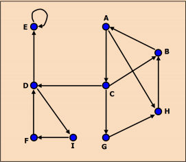
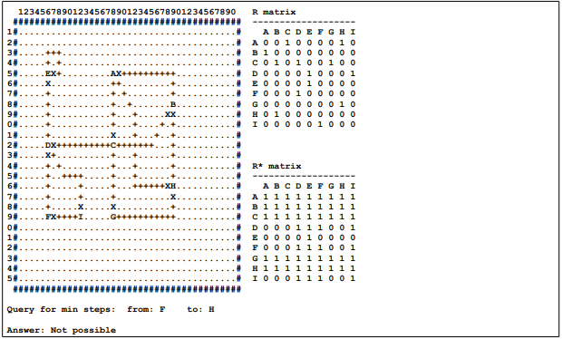

# Project: Grapher
Dokuz Eylül University

Project Based Learning Lesson Pratical Project Dec. 2019 

The aim of the project is to develop a graph application.

**General Information**

The application has a board with 25 * 40 squares. In this application; user can draw, load, save a graph, and
calculate R, R2, R3, ... , Rn, R* and Rmin matrices. R matrix gives directly connected nodes (1 step away). R2 matrix gives 
exactly 2 steps away points. Rn matrix gives exactly n steps away points. R* matrix gives all
connected points. Rmin matrix gives the minimum number of steps required for going point a to point b.

**Graph Drawing and Matrix Calculation Stages**

1. Graph can be drawn manually or loaded from "graph.txt" file.
   Loaded graph is shown on the screen, additional drawing is possible. A graph can also be saved.
2. R relation matrix (adjacency matrix) is formed by tracing the graph.
3. Calculate R2, R3, ... , Rn matrices for the graph (n: the number of nodes/points)
4. Calculate R* (transitivity closure or connectivity relation) matrix.
5. Calculate Rmin matrix which shows the minimum number of steps required for going point a to point b.
6. Save R, R2, R3, ... , Rn, R* and Rmin matrices to the "matrix.txt" file. 

**Keyboard Commands**

 **Drawing Keys:**
 * Cursor movement keys: To move the cursor on the graph
 * Letters A-P: Put a node to the cursor's position
 * X : Put an ending edge part (X) to the cursor's position
 * space : Put an edge part (+) to the cursor's position 
 * . : Delete the symbol at the cursor's position ( . symbol = empty square) 
  Calculation and Display Keys:  
 * 1 : Trace the graph to form R relation matrix. Calculate R2, R3, ... , Rn, R* and Rmin matrices.
 Show R matrix on the top right section of the screen.
 Show R* matrix on the bottom right section of the screen. 
 * 2-9 : Show R2, R3, ... or Rn matrix on the bottom right section of the screen. 
 * 0 : Show Rmin matrix on the bottom right section of the screen.
 directionchange square to-

**Query key:** 
 * Q : Takes 2 nodes (a and b), and returns min number of steps required for going node a to node b. 
 

 
